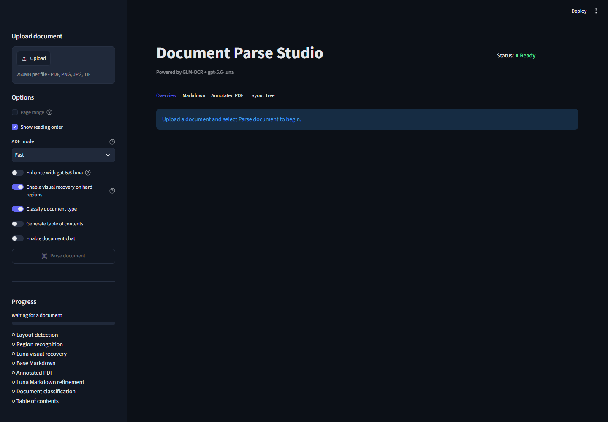

# Grounded Document Parser

A workstation-oriented Streamlit studio that parses native documents, scanned PDFs, and images with explicit per-file routing. Native PDFs use `pdf-inspector`; Word, PowerPoint, Excel, CSV, HTML, EPUB, and other supported native formats use Docling without OCR. Scanned PDFs and images retain the local GLM-OCR or PaddleOCR-VL-1.6 pipeline. Optional LangExtract extraction is grounded back to immutable source text and anchors.

Repository: [github.com/pypi-ahmad/grounded-docparse](https://github.com/pypi-ahmad/grounded-docparse)

For OCR inputs, the selected local OCR engine owns layout, element IDs, normalized bounding boxes, types, confidence, and reading order. PaddleOCR-VL-1.6 uses the full PP-DocLayoutV3 plus PaddleOCR-VL-1.6-0.9B pipeline with a local vLLM recognition backend. Luna visual recovery can replace only text on an existing element when the returned confidence is at least `0.85`; additions, deletions, geometry changes, type changes, and reading-order changes are ignored. Every Luna request uses medium reasoning effort.

Native inputs preserve their original structure. Each element has an immutable `base_text` span and a `SourceAnchor` that identifies its page, paragraph, slide, shape, sheet/cell, table, or CSV row/column. Embedded native-document images are recorded as assets and are not OCRed in v1.

```text
upload
  -> required processing-type selection for every file
  -> signature/container validation
  -> native PDF / mixed PDF / Docling / scanned-image pipeline
  -> immutable base_text, source spans, and anchors
  -> Markdown, JSON, and source-structure outputs
  -> optional grounded LangExtract, classification, TOC, refinement, and chat
```

Supported processing types are `native-pdf`, `scanned-pdf`, `mixed-pdf`, `word`, `powerpoint`, `excel`, `csv`, `image`, and `other-native`. The UI and CLI require a compatible selection for each file; wrong selections are blocked and never silently rerouted.

## Application preview



Scanned PDFs and images are rendered to pixels. Native PDFs use `pdf-inspector` for native text, layout, tables, and positions; `pdf-inspector` never performs OCR. Docling handles supported native Office, CSV, HTML, EPUB, and related formats with OCR, VLM, remote services, plugins, and model enrichments disabled. If at least one scanned page is nonblank and none of the nonblank pages contains a local OCR layout region, parsing stops before Luna features run; isolated page failures remain visible as warnings.

For a Mixed PDF, `pdf-inspector` suggests a Native or OCR route per page. The user reviews the page table, may override suggestions, confirms every page, and receives the merged result in original page order. A Native PDF with unusable pages stops and suggests Mixed PDF instead of silently falling back.

When GLM-OCR is selected, form-heavy scans receive a GLM-only recovery pass for every eligible risky region, capped at three per page. For PDFs parsed with PaddleOCR-VL, incomplete checkbox tables may receive a conservative local recovery pass; a state is accepted only when independent 190 and 200 DPI parses agree. Both engines then enter the same deterministic quality and optional Luna-recovery stages.

## Install and set up

The supported installer target is Windows 10 22H2 or Windows 11 x64 with AVX2, at least 16 GB RAM, 20 GB free disk, and network access during first setup. It installs or reuses WSL2, Ubuntu 24.04, Python, dependencies, and pinned models. NVIDIA CUDA uses vLLM; AMD uses Ollama acceleration when supported; every failed or unavailable GPU path falls back to Ollama CPU.

1. Clone the repository from PowerShell:

   ```powershell
   git clone https://github.com/pypi-ahmad/grounded-docparse.git
   Set-Location grounded-docparse
   ```

2. Run setup. It installs missing Windows/WSL dependencies and resumes after a required restart:

   ```powershell
   .\Setup-GLM-OCR.cmd
   ```

   On a release, run `GroundedDocParse-<version>-Setup.exe` instead; Git is not required. Setup reuses a healthy Ubuntu user or securely prompts once for Linux credentials.

3. Optional: enable Luna visual recovery and document reasoning by saving the OpenAI values in the Windows user environment. Skip this step for local-only parsing.

   ```powershell
   [Environment]::SetEnvironmentVariable("OPENAI_API_KEY", "your-key", "User")
   # Optional OpenAI-compatible endpoint:
   # [Environment]::SetEnvironmentVariable("OPENAI_BASE_URL", "https://example.com/v1", "User")
   ```

4. For later sessions, start or reuse the managed services with:

   ```powershell
   .\Launch-GLM-OCR.cmd
   ```

   To start with PaddleOCR-VL-1.6 selected, use `Launch-PaddleOCR-VL-1.6.cmd`. Either launcher can switch the exclusive GPU backend later from the in-app model dropdown.

`Launch-GLM-OCR.cmd` refreshes `OPENAI_API_KEY` and optional `OPENAI_BASE_URL` from Windows user scope each time. See [setup](SETUP.md) for manual WSL installation, configuration, security boundaries, and troubleshooting, or [run commands](docs/run.md) for service lifecycle commands.

For a manual development install of native parsing and grounded extraction, use:

```powershell
uv sync --locked --extra native
```

The native extra provides `pdf-inspector`, Docling, and LangExtract. Native parsing itself does not OCR embedded images.

## Supported inputs and routing

Every uploaded file has its own required processing-type selector. Batch files may use different selections, but each selection must match the file's signature and container structure.

| File | Required selection | Pipeline |
| --- | --- | --- |
| `invoice.pdf` | Native PDF / Scanned PDF / Mixed PDF | `pdf-inspector`, existing OCR, or reviewed per-page merge |
| `report.docx` | Word | Docling native extraction |
| `slides.pptx` | PowerPoint | Docling native extraction |
| `accounts.xlsx` | Excel | Docling native extraction |
| `records.csv` | CSV | Native CSV structure extraction |
| `document.odt`, `document.odp`, `document.ods`, `document.html`, `document.md`, `document.epub` | Other Native | Docling/native structure extraction |
| `scan.png`, `scan.jpg`, `scan.jpeg`, `scan.tif`, `scan.tiff` | Image | Existing OCR pipeline |

Wrong combinations are blocked. For example, a DOCX cannot be selected as Native PDF, and a Native PDF with unusable pages cannot silently become Scanned PDF. Mixed PDF processing additionally requires a complete, confirmed Native/OCR route for every page.

## How to use the app

1. Upload up to 20 supported files (250 MB per file and 1 GB combined). Files are processed sequentially. An optional inclusive page range is available only for one scanned PDF; native and mixed inputs process the selected document structure/pages.
2. Select a processing type for every file in **Processing types**. For Mixed PDF, review the suggested page routes, override any page, and confirm the complete table before processing.
3. For scanned PDFs and images, choose **GLM-OCR** or **PaddleOCR-VL-1.6** from **Document extraction model**, then choose an **ADE mode** for optional Luna features:
   - **Fast**: classification is the only preset-controlled Luna feature; visual recovery is a separate toggle and defaults on when a key is available.
   - **Full**: Markdown refinement, classification, and TOC generation.
   - **Custom**: any other combination of those toggles.
4. Keep visual recovery enabled to inspect prioritized hard regions. The Luna budget scales from eight crops to the configured ceiling of 64 based on document length and remains capped at three crops per page.
5. Select **Parse document** or **Process documents**. A failed file does not stop the rest of the queue; running the batch again retries failures and skips unchanged completed files.
6. Choose a file from **Document results**. Native results expose Overview, Markdown, JSON, source structure, Extract, optional Chat, and Layout Tree. Annotated PDF is shown only when the pipeline produces a visual artifact.
7. Download individual results or **Download all outputs**. The ZIP includes every original, a manifest, Markdown, full JSON, extraction JSON when requested, and annotated PDF only when available.

The latest batch is saved locally and restored after an app restart. Sources, parse results, document analysis, failures, progress, settings, and usage survive; interrupted documents resume from the last completed parse checkpoint when **Resume batch** is selected. Use **Clear saved workspace** to remove the durable batch. Extraction, routing review, and chat remain session-only.

Extraction is always on demand after parsing. Native extraction sends immutable `base_text` to LangExtract, never refined Markdown. A returned value is accepted only when it includes a `char_interval` whose exact substring resolves through the native source spans to at least one `SourceAnchor`; ungrounded values are rejected. The field builder remains available for flat scalar fields. **Raw JSON Schema** mode stores and routes the supported strict nested schema subset, including objects, arrays, enums, and nullable booleans for checkbox/selectable fields. Imported raw JSON Schemas use the filename as their saved name; saved-schema envelope imports remain backward compatible. Markdown, CSV, and XLSX imports populate the flat field builder.

Flat field schemas can be imported from Markdown, CSV, or XLSX. CSV and the first XLSX worksheet use `Field name`, `Description`, and `Type` columns. The filename becomes the schema name, and an empty type defaults to `string`.

Markdown supports a table or bullet list (not both), with an optional H1 schema name and optional type (`string` by default):

```markdown
# Invoice
| Field name | Description | Type |
| --- | --- | --- |
| invoice_number | Official invoice ID | string |
| total_amount | Final payable amount | number |
```

```markdown
# Invoice
- invoice_number: Official invoice ID
- total_amount (number): Final payable amount
```

Supported types are `string`, `number`, `integer`, `boolean`, and `date`. Imports populate an editable draft and do not save automatically. Without a Markdown H1, the filename becomes the schema name.

For mixed-form PDFs, enable **Use custom form routing** in Extract. A reusable routing profile defines category keys and descriptions, which categories are extractable, and the saved extraction schema assigned to each eligible category. Luna classifies contiguous page ranges from grounded Markdown/layout; results below 85% confidence require review. Users may correct ranges and categories before selecting **Extract eligible forms**. Only approved, eligible segments are sent for extraction. After all segments are approved, **Download split documents** exports every segment as separate PDF, Markdown, and JSON files in a dedicated ZIP. Routing profiles support the same editable, JSON, and Markdown workflows as extraction schemas; `other` is always a non-extractable fallback.

Chat is off by default and sends no request until enabled and a question is submitted. **Show source** actions open the cited annotated page and highlight the local-OCR-owned box.

## CLI batch parsing

Use `ingest` when you want explicit native/OCR routing. Every input requires one `--processing-type PATH=TYPE` assignment; assignments cannot be missing, duplicated, or supplied for an unknown input. File signatures and Office/container structure are still validated:

```powershell
grounded-docparse ingest invoice.pdf `
  --processing-type invoice.pdf=native-pdf `
  --schema invoice.schema.json `
  --output output
```

Batch files keep independent selections:

```powershell
grounded-docparse ingest invoice.pdf scan.pdf report.docx accounts.xlsx records.csv `
  --processing-type invoice.pdf=native-pdf `
  --processing-type scan.pdf=scanned-pdf `
  --processing-type report.docx=word `
  --processing-type accounts.xlsx=excel `
  --processing-type records.csv=csv `
  --output output
```

Mixed PDF processing requires a route for every page. The UI displays the `pdf-inspector` suggestion and lets the user override it; the CLI supplies the confirmed routes explicitly:

```powershell
grounded-docparse ingest mixed.pdf `
  --processing-type mixed.pdf=mixed-pdf `
  --page-route mixed.pdf#1=native `
  --page-route mixed.pdf#2=ocr `
  --page-route mixed.pdf#3=native `
  --output output
```

Native extraction accepts saved schemas with `--schema`. It sends only immutable `base_text` to LangExtract, using `gpt-5.6-luna` at medium reasoning effort. Set `OPENAI_API_KEY` and optional `OPENAI_BASE_URL` in the environment. Only exact source substrings with a `char_interval` resolving through source spans are accepted. Numbers and literal `true`/`false` are parsed deterministically. Raw schemas support nested objects and one array level; nested arrays are rejected.

The legacy `parse` command remains the synchronous OCR batch command for PDFs and images:

```powershell
grounded-docparse parse input.pdf --schema invoice.json --output results
grounded-docparse parse .\incoming --schema invoice.md --output results --overwrite
```

`--schema` is optional and applies one JSON or Markdown extraction schema to every input. `parse` writes Markdown, annotated PDF, Full JSON, and extraction JSON when requested. `ingest` writes Markdown and Full JSON/source structure, adds extraction JSON when requested, and writes an annotated PDF only when the selected pipeline produces one. Both commands use deterministic output folders and a root `manifest.json`; processing continues after individual failures and returns exit code `1` if any document fails. A non-empty output directory requires `--overwrite`; unrelated files are preserved.

## Outputs

- Refined Markdown plus grounded `base_markdown` for the legacy OCR/refinement pipeline
- Native Markdown plus immutable `base_text` and source-structure mappings
- Parse JSON v4.5.0 with normalized elements, page/block evidence, provenance, correction history, usage/trace, recovery log, and optional OCR-comparison evidence
- Full JSON v4.6.0 using the same envelope with current classification, sections, legacy extraction, custom form routing, per-form extraction, combined usage/trace, and feature statuses populated
- Native document JSON schema 5.0.0, or combined native/extraction JSON schema 5.1.0, with units, elements, assets, source spans, `SourceAnchor` values, and requested/effective routes
- Extraction JSON v1.1.0 with values, evidence, `element_id`, source text, confidence, and local-OCR-owned normalized boxes
- Native extraction JSON with exact `char_interval` evidence and resolved source anchors
- Annotated PDF with semantic colors, reading-order labels, selected-element highlighting, and dashed Luna-recovery boxes when a visual artifact is available
- Run metadata including GLM, Luna recovery, and Luna agentic timing

Annotated PDF bytes are downloaded separately and are not embedded in JSON. Native nonvisual formats may have no annotated PDF at all. Reusable extraction schemas and routing profiles persist in the gitignored SQLite database at `data/document_studio.sqlite3` unless `DOCPARSE_STUDIO_DB_PATH` overrides it.

## Public Python API

The package exports `DocumentParser`, `UniversalDocumentParser`, `DocumentAgent`, `DocumentExtractor`, `ParserConfig`, `ProcessingType`, `SourceAnchor` models, result models, and native/legacy render helpers.

```python
from pathlib import Path

from grounded_docparse import (
    DocumentAgent,
    DocumentParser,
    ProcessingType,
    UniversalDocumentParser,
    render_combined_result,
)

source = Path("invoice.pdf")
result = DocumentParser().parse(
    source.read_bytes(),
    source.name,
    refine_markdown=False,
    visual_recovery=True,
)

native_result = UniversalDocumentParser().parse(
    source.read_bytes(),
    source.name,
    processing_type=ProcessingType.NATIVE_PDF,
)

agent = DocumentAgent()
analysis = agent.analyze(result, classify=True, generate_toc=False)
full_json = render_combined_result(result, analysis)
```

`DocumentParser.parse` is synchronous for the legacy OCR pipeline. `UniversalDocumentParser.parse` is synchronous for manually selected native, scanned, mixed, and image routes. Luna failures do not invalidate a successful local OCR parse; unavailable or failed optional features expose warnings or feature statuses. See the complete [Python API contract](docs/api.md).

## Repository layout

```text
.
├── Setup-GLM-OCR.cmd             # First-run Windows/WSL bootstrap and launch
├── Launch-GLM-OCR.cmd            # Subsequent Windows launcher
├── Launch-PaddleOCR-VL-1.6.cmd   # Start with PaddleOCR selected
├── paddle-runtime/               # Isolated locked Paddle/vLLM environment
├── streamlit_app.py              # Streamlit entry point
├── src/grounded_docparse/        # OCR, native parsers, models, gateways, renderers, agentic layer
│   ├── native.py                 # Processing types, source anchors, spans, and native result contracts
│   ├── universal.py              # Signature validation and explicit format routing
│   ├── native_parsers.py         # pdf-inspector and Docling native pipelines
│   └── native_extraction.py      # Grounded LangExtract integration
├── config/glmocr.yaml            # Source GLM-OCR SDK configuration
├── scripts/wsl/                  # Locked WSL setup and launch scripts
├── scripts/                      # Corpus generation and evaluation utilities
├── benchmarks/                   # Versioned corpus, schemas, rate cards, baselines
├── examples/                     # Synthetic documents and extraction schema
├── tests/                        # Offline contract and behavior tests
├── docs/                         # Architecture, operation, API, workflows, research
├── pyproject.toml                # Package metadata and dependency declarations
└── uv.lock                       # Cross-platform locked dependency graph
```

## Documentation

| Guide | Purpose |
| --- | --- |
| [Setup](SETUP.md) | Supported Windows/WSL installation, runtime configuration, and troubleshooting |
| [Run locally](docs/run.md) | Launcher behavior, manual service commands, and shutdown steps |
| [Tutorial](docs/tutorial.md) | End-user walkthrough of parsing, extraction, chat, and downloads |
| [Complete user guide](docs/complete-user-guide.md) | In-depth feature and workflow guide for business users, reviewers, and technical operators |
| [Zero-to-hero technical tutorial](docs/zero-to-hero-tutorial.md) | First-principles setup, usage, Python integration, internals, testing, and production boundaries |
| [Business extraction workflow](docs/business-user-extraction-workflow.md) | Non-technical workflow for large reusable field sets |
| [Architecture](docs/architecture.md) | Components, ownership rules, pipeline stages, and failure boundaries |
| [Python API](docs/api.md) | Exported names, signatures, schemas, and result contracts |
| [Private evaluation](docs/private-evaluation.md) | Confidence calibration, review-rate tracking, and regression gates |
| [Product specification](docs/spec.md) | Required behavior, public interfaces, and non-goals |
| [Local GLM-OCR](docs/local-glmocr.md) | Locked GLM-OCR/vLLM runtime and evaluation path |
| [Local PaddleOCR-VL-1.6](docs/local-paddleocr-vl.md) | Isolated Paddle runtime installation, health checks, and troubleshooting |
| [Azure bulk medical fax deployment](docs/azure-bulk-fax-deployment.md) | Production design and operations runbook for secure bulk medical-fax processing on Azure |
| [Security policy](SECURITY.md) | Reporting process, deployment boundary, egress, and retention |

## Development

```powershell
uv sync --locked
uv run pytest -q
uvx ruff check src streamlit_app.py tests scripts
uv run python -m compileall -q src streamlit_app.py tests scripts
git diff --check
```

Live evaluation is opt-in and must run inside WSL with the setup-created environment while the local GLM service is available. External references default to generated-reference diagnostics unless an explicit reference basis is supplied. Use `--glm-only` to disable and verify the absence of Luna recovery, refinement, and extraction:

```bash
source "${DOCPARSE_WSL_ENV:-$HOME/.local/share/grounded-docparse/.venv}/bin/activate"
python scripts/evaluate_corpus.py --live --glm-only \
  --document synthetic-report \
  --artifacts-dir output/synthetic-report-glm-only \
  --output output/synthetic-report-glm-only.eval.json
```

The bundled public/synthetic corpus is a regression suite, not evidence of broad production accuracy or equivalence with an external product. See [extraction quality research](docs/extraction-quality-research.md), [architecture](docs/architecture.md), and [specification](docs/spec.md).

For document-type accuracy, confidence calibration, review-rate tracking, and
absolute/baseline regression gates, use the
[private evaluation workflow](docs/private-evaluation.md). Private calibration
and locked holdout documents remain outside the repository.

Licensed under the [MIT License](LICENSE).
