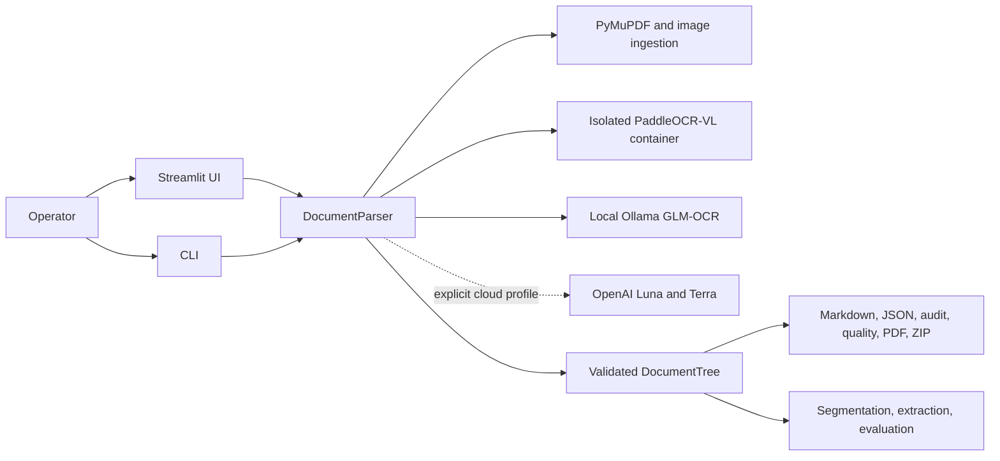
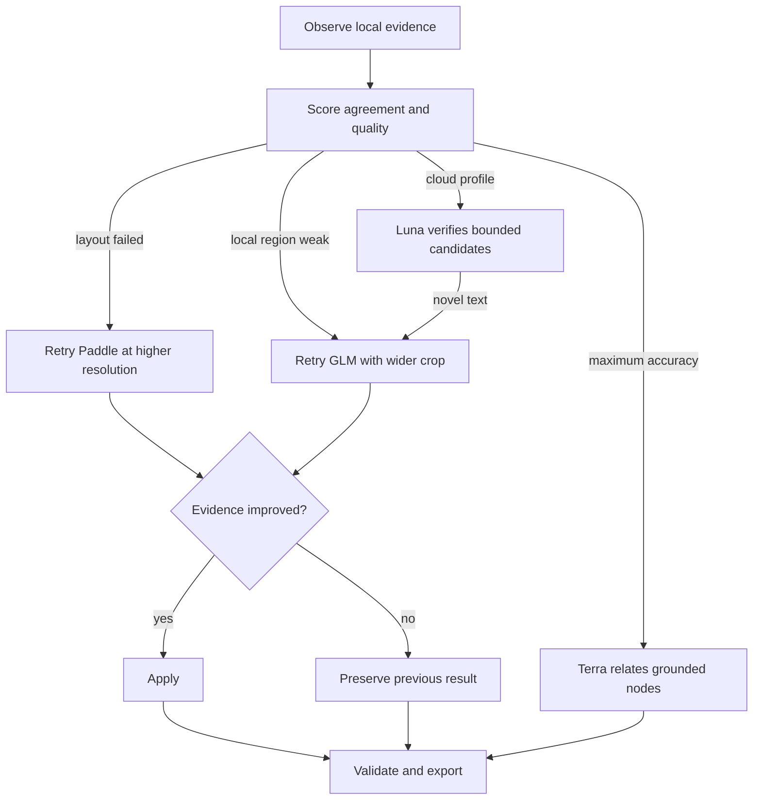

# Architecture and Design

## Purpose

Grounded Document Parser turns untrusted PDF and image uploads into two
complementary representations:

1. A physical record of pages, regions, coordinates, candidates, and provider
   evidence.
2. A semantic document tree suitable for retrieval, extraction, reasoning, and
   human review.

The central design rule is that reasoning may organize evidence, but it may not
invent evidence. Text reaches an export only through a recognized candidate and
the final tree retains its page, bounding box, confidence, and provenance.

## System context



The UI and CLI are thin adapters. `DocumentParser` owns orchestration and
returns a `ParseResult`; renderers and reviewers derive every artifact from the
validated `DocumentTree`.

## Component map

| Area | Responsibility |
|---|---|
| `ingest.py` | Validate signatures and limits; render pages; extract native spans, links, fonts, and coordinates; enhance scans |
| `paddle.py` / `paddle_worker.py` | Run the official PaddleOCR-VL pipeline in Docker; normalize regions and table cells |
| `gateways.py` | Type-routed GLM recognition and schema-constrained OpenAI decisions |
| `pipeline.py` | Orchestrate providers, retries, reconciliation, hierarchy, citations, segmentation, extraction, and exports |
| `models.py` | Pydantic contracts for evidence, nodes, trees, retries, batches, and results |
| `domain.py` | Detect or apply document profiles and grounded field/validation rules |
| `segmentation.py` | Classify pages, detect identifiers and boundaries, and slice sub-document trees |
| `extraction.py` | Validate the supported JSON Schema subset, map fields, stitch logical tables, and create sidecars |
| `evaluation.py` | Compare a parse with a corrected same-source tree using deterministic metrics |
| `render.py` | Escape and render Markdown, LLM Markdown, JSON, and ZIP bundles |
| `audit.py` / `failures.py` | Produce safe operational summaries and structured failure cases |
| `review.py` | Build quality reports, annotated PDFs, page previews, and batch bundles |
| `streamlit_app.py` | Batch processing, source preview, synchronized read-only review, and downloads |

## End-to-end data flow

### 1. Boundary validation and ingestion

`DocumentParser.parse` validates an optional extraction schema before reading
the document. `ingest_document` then checks the extension and file signature,
size, page count, password state, and rendered-pixel limits.

PDF pages are rendered at 300 DPI by default. Native text blocks retain PDF
point coordinates and normalized coordinates. A page with fewer than 20 native
characters is treated as scanned for preprocessing and recognition routing;
Paddle still analyzes every page. Scans are deskewed, denoised, and contrast
enhanced without modifying the source file.

### 2. Layout perception with PaddleOCR-VL

The full source is sent to the digest-pinned PaddleOCR-VL Docker image. Long
PDFs are split into temporary 25-page source chunks, and provider work is
reported in 10-page windows while original page numbers remain stable.

Paddle supplies ordered regions, semantic labels, text, tables, formulas,
charts, figures, and cell coordinates where available. Its output is validated
and converted into bounded `RegionEvidence`. When Paddle is disabled or fails,
the pipeline falls back to native blocks or a full-page region and records a
warning rather than silently declaring success.

### 3. Automatic page-layout recovery

A page is eligible for one layout retry when Paddle reports a provider error or
the page has only a full-page fallback. The page is enlarged toward 450 DPI,
bounded by `DOCPARSE_MAX_PAGE_PIXELS`, and sent through Paddle again.

The deterministic layout score gives equal weight to regions with coordinates
and regions with non-empty text. The retry replaces the original layout only
when this score improves. Applied, rejected, and failed attempts are retained
as `AdaptiveRetryRecord` entries.

### 4. Independent local recognition

GLM-OCR receives crops rather than the full document. Region type selects a
text, table, formula, or figure prompt. Scanned pages route every region through
GLM; digital pages use native text unless the region is complex or evidence
conflicts.

Processing is sequential to avoid simultaneous Paddle and GLM GPU pressure.
Ten-page recognition windows are retried according to
`DOCPARSE_WINDOW_RETRY_COUNT`; exhausted windows become degraded and preserve
the evidence that remains.

### 5. Candidate reconciliation and local recovery

Native, Paddle, and GLM text become `RecognitionCandidate` objects. The
reconciler compares normalized text and caps agreement below the acceptance
threshold whenever numeric tokens differ. Preferred source order depends on
whether the page is scanned and whether the region is structurally complex.

In `local-only`, disputed, unreadable, unresolved, or sub-0.65-confidence
regions receive one GLM retry using an 8% wider crop and an image enlarged up to
twice the page DPI, capped at 1200 DPI. The new candidate is selected only when
it resolves previously unusable evidence or improves confidence. Otherwise the
prior selection is restored while the retry candidate remains auditable.

### 6. Optional cloud verification

Cloud calls exist only for `hybrid` and `maximum-accuracy` profiles and require
`OPENAI_API_KEY`.

- **Hybrid:** Luna sees only uncertain regions with their page image and may
  select an existing candidate or request a retry.
- **Maximum accuracy:** Luna verifies every page. Terra may update heading roles
  and add cross-page relationships such as continuation, caption, footnote,
  reference, and same-table links.

A novel Luna transcription is provisional. The pipeline performs an unbiased
second GLM recognition from a wider, enlarged crop without disclosing Luna's
answer. The correction is usable only when local evidence confirms it. Terra
receives grounded node summaries and cannot rewrite text or create nodes.

### 7. Tree construction and grounding

The intermediate evidence becomes `DocumentTree` schema 1.9.0. Stable node IDs
are derived from the source hash, page, order, type, and bounding box.

```text
Document
├── Pages                         physical index
│   └── content_node_ids
└── Sections                      semantic index
    ├── Heading
    ├── Paragraph / List
    ├── Table → Row → Cell
    ├── Figure / Chart → Caption
    ├── Formula
    └── FormField / Checkbox / Signature / Seal
```

The same content node can be reached from its physical page and semantic
section. This avoids duplicating text while supporting page overlays and
meaningful traversal. Each node can carry normalized/source coordinates,
reading order, candidates, the selected candidate, confidence signals,
citations, provenance, relationships, and rendered Markdown.

Tables preserve physical cells and merged spans. Exact cell boxes are used
when Paddle provides them; otherwise cells explicitly inherit table-level
grounding. Repeated headers and footers are related rather than deleted.

### 8. Domain profiles and multi-document segmentation

The pipeline applies an operator-selected or automatically detected document
profile. Profiles add normalized fields and non-decisional validation findings
grounded to existing nodes; they do not replace the document tree.

With segmentation enabled, every page is classified and inspected for stable
identifiers such as invoice number, order ID, claim number, and date. A
deterministic boundary engine keeps uncertain adjacent pages together. In cloud
profiles Luna may adjudicate an uncertain two-page boundary; maximum-accuracy
may escalate an unresolved boundary to Terra. Only decisions with at least 0.65
confidence override the conservative result.

Each PDF segment receives its own physical source PDF, tree, Markdown, audit,
quality report, annotated PDF, assets, and ZIP. Source and segment page numbers
are both retained.

### 9. Schema-first extraction and logical tables

An optional, bounded subset of Draft 2020-12 JSON Schema defines the desired
shape. Deterministic matching uses grounded profile fields, labels, form pairs,
captions, and headers. Hybrid asks Luna only about unresolved scalar paths;
maximum-accuracy verifies mappings more broadly and can use Terra for remaining
unresolved paths. Models select existing node IDs and literal values; the
application derives provenance from those nodes.

Every extracted leaf uses an RFC 6901 JSON Pointer with page, node, bounding
box, confidence, and optional table-cell coordinates. Continued page tables are
stitched into logical tables for JSONL and CSV export without modifying their
physical table nodes.

### 10. Validation and export

Before rendering, the pipeline validates node references, hierarchy, citations,
limits, links, table metadata, extraction provenance, and model decisions.
Renderers escape untrusted text and links.

The final result includes structured Markdown, grounded LLM Markdown, JSON,
audit JSON, failure JSONL, quality JSON, annotated PDF, image assets,
sub-documents, table sidecars, and a ZIP bundle. The UI's combined batch ZIP
prefixes each document's files and includes a batch manifest.

## Agentic control loop

The system is agentic in a constrained engineering sense:



Planning is represented by deterministic triggers and bounded escalation, not
an unrestricted model deciding arbitrary actions. Every retry has a fixed
scope, fixed maximum count, explicit providers, an acceptance test, and an
audit record.

## Processing profiles and trust boundaries

| Boundary | Local only | Hybrid | Maximum accuracy |
|---|---|---|---|
| Document bytes | Local | Local | Local |
| Paddle container | Full source, offline | Full source, offline | Full source, offline |
| GLM via Ollama | Region crops | Region crops | Region crops |
| Luna | Never called | For each page containing uncertainty: the full page image and only its uncertain regions | Every page image and all its regions |
| Terra | Never called | Not used for document resolution | Grounded summaries and difficult boundary/extraction cases |

The runtime Paddle container uses no network, a read-only root filesystem and
model cache, dropped Linux capabilities, `no-new-privileges`, bounded memory,
PID and shared-memory limits, isolated mounts, and timeout cleanup. Cache
warm-up is deliberately separate because it requires network access and a
writable cache volume.

Uploads, document text, model output, filenames, hyperlinks, and provider
errors are treated as untrusted. Raw document contents and secrets are excluded
from structured failure records. Cloud consent is per Streamlit run; no content
is persisted to a database by this project.

## Scalability model

The current design scales up within one workstation, not horizontally across a
cluster:

- Individual inputs are bounded to 500 pages and 250 MB by default.
- Paddle processes 25-page source chunks sequentially.
- Recognition uses 10-page windows with bounded in-run retries.
- Streamlit accepts 10 files or 1 GB and processes files sequentially.
- Table dimensions and total cells have explicit limits.
- Temporary run data lives under `.docparse` and is removed when the run exits.

Processing millions of pages requires an external durable queue, worker pool,
object storage, idempotent job records, metrics, and backpressure. Those
distributed-system concerns are intentionally outside this repository.

## Failure and observability model

Provider boundaries fail soft when deterministic evidence remains. Warnings
name the stage and safe exception type. `model_runs` capture provider, model,
stage, page or region, prompt version where applicable, latency, and token
counts. Window and adaptive-retry records explain degraded or recovered work.

`quality.json` reports OCR coverage, disagreements, unresolved nodes, mean
confidence, candidate counts, warnings, retries, and table grounding proxies.
These are operational signals, not measured accuracy. True accuracy is produced
only by evaluation against a corrected tree for the exact same source hash.

## Design decisions and tradeoffs

### Dual physical and semantic indexes

This supports both visual audit and semantic traversal without cloning content.
The cost is more reference validation than a flat list.

### Two independent local perception paths

Paddle is strong at page structure; GLM supplies independent region text. Their
disagreement exposes risk that a single OCR confidence score would hide. The
cost is additional GPU time.

### Deterministic final authority

Models propose typed decisions, but code controls selection, grounding,
relationships, retries, and rendering. This improves auditability at the cost
of rejecting some correct vision-only answers that lack independent support.

### Physical tables remain immutable

Logical continued tables and extraction views are derived separately. This
preserves page evidence and makes reconstruction reversible, at the cost of two
table representations.

### Read-only review

The UI exposes candidates, confidence, citations, and overlays but does not
edit OCR text or manually trigger providers. This keeps exported evidence
reproducible. Human correction capture and model-training feedback loops remain
future work.

## Extension points

- Add a document profile in `domain.py` and cover its grounded fields and
  validation findings with public-contract tests.
- Add a provider behind a typed gateway; convert its output to existing
  candidates or decisions rather than bypassing `DocumentTree`.
- Add an export by consuming the validated tree; do not re-run OCR in a
  renderer.
- Add a retry only with a bounded trigger, maximum count, deterministic
  acceptance rule, and `AdaptiveRetryRecord`.
- Add evaluation metrics in `evaluation.py` without collapsing dimensions into
  an opaque composite score.

Any schema-breaking `DocumentTree` change requires an explicit version update,
migration consideration, renderer changes, and contract tests.
