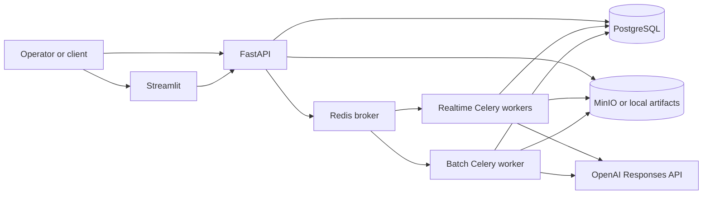
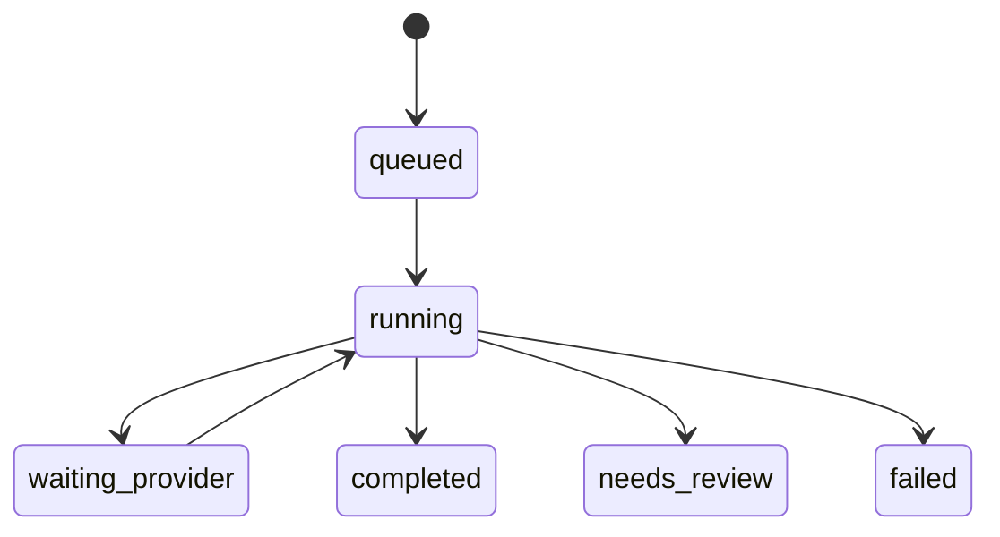

# Architecture and Design

## Purpose

Grounded Document Parser is an asynchronous document-extraction service that preserves the relationship between every emitted value and visible source evidence. It favors explicit unresolved states over unsupported text.

Two execution paths remain in the repository:

- The production path uses Luna for page drafting and Terra for independent visual inspection. It is selected by `fast`, `balanced`, and `maximum`.
- The compatibility path uses native PDF text, PaddleOCR-VL, GLM-OCR, and optional OpenAI adjudication. It is selected by `local-only`, `hybrid`, and `maximum-accuracy`.

The default Compose deployment is designed for the production path. It does not provide Paddle or Ollama services.

## System context

In API mode, the API validates uploads, persists source bytes, creates a durable job row, and dispatches a Celery task. Workers own parsing and artifact production, so browser reruns do not own or cancel work. Streamlit also has a local testing mode that invokes `DocumentParser` in-process using `OPENAI_BASE_URL` and `OPENAI_API_KEY`; that mode is synchronous and non-durable.

## Component responsibilities

| Component | Responsibility |
| --- | --- |
| `api.py` | Bearer authentication, submission, status, artifacts, reviews, evaluation, and purge |
| `jobs.py` | Job transitions and local or S3-compatible artifact storage |
| `worker.py` | Queue routing, retries, processing-cache lookup, parsing, and artifact persistence |
| `pipeline.py` | Production and compatibility parsing orchestration |
| `gateways.py` | Typed OpenAI and GLM provider calls |
| `ingest.py` | Upload validation, PDF/image ingestion, page rendering, and source crops |
| `models.py` | Validated document, grounding, verification, segmentation, and extraction contracts |
| `render.py` | Markdown, strict LLM Markdown, JSON, and ZIP bundle generation |
| `review.py` | Quality reports and annotated PDF rendering |
| `segmentation.py` | Page classification, instance detection, boundaries, and subdocuments |
| `evaluation.py` | Deterministic comparison with a corrected document tree |
| `streamlit_app.py` | Local parsing or async submission, polling, source preview, and bundle download |

## Job lifecycle

`waiting_provider` is used when OpenAI returns a connection, timeout, or rate-limit error. Celery retries those failures with exponential backoff, jitter, and a maximum of three retries. Other exceptions terminate the job as `failed` with a bounded error string.

A worker returns an already-terminal job unchanged. This makes duplicate delivery safe at the task boundary. `cancelled` and a future `needs_review` to `completed` transition exist in the internal state model, but no current HTTP endpoint reaches them.

## Production data flow

### 1. Boundary validation and ingestion

The API accepts supported PDF and image extensions, strips directory components from filenames, reads the upload, and stores its SHA-256 digest. Ingestion validates file size, page count, dimensions, and supported content before provider calls.

Digital PDFs retain native blocks as supporting evidence. Full pages are rendered at `DOCPARSE_RENDER_DPI`, which defaults to 200 DPI.

### 2. Luna page draft

For each page, Luna receives the page image and a strict `PageDraft` output contract. It returns ordered regions with:

- region type and semantic role;
- normalized bounding box and reading order;
- literal text or Markdown;
- tables and table cells;
- form fields and checkbox state;
- figure or chart structure; and
- confidence signals.

The application creates stable region IDs and converts normalized boxes into pixel and PDF coordinates. Every grounded node receives a source crop reference and crop SHA-256.

`fast` stops after this stage. Its nodes are `grounded`, not independently `verified`, so strict LLM Markdown emits unresolved markers instead of draft text.

### 3. Terra page inspection

`balanced` and `maximum` send the draft, region IDs, and page image to Terra under a strict `PageInspection` contract. Each decision is one of:

- `accept`: retain the literal draft and mark it verified;
- `correct`: replace it with visually supported literal text and mark it verified;
- `reject`: preserve the audit record but exclude the value from strict outputs; or
- `inspect_crop`: request a closer source rendering.

Every decision must cite one or more evidence references. The application—not the model—maps decisions back to known regions and applies state transitions.

### 4. High-resolution crop loop

Requested crops are rendered directly from the original PDF or image at 450 DPI. Default padding is 5% and model-requested padding remains bounded. Balanced permits one crop inspection; Maximum permits two.

The crop hash and coordinate variants remain attached to the node. A crop request that does not resolve becomes `needs_review`; it is not accepted by timeout or majority vote.

### 5. Deterministic materialization

Validated page evidence is transformed into:

- physical page and content-node indexes;
- semantic section hierarchy;
- citations and provenance;
- form, checkbox, table, and visual structures;
- document classification and grounded fields;
- logical tables and table exports;
- mixed-document boundaries and subdocuments;
- schema-defined extraction with per-value citations;
- quality, failure, and audit reports; and
- annotated PDF and ZIP artifacts.

Models propose bounded evidence. Deterministic code owns identifiers, coordinate conversion, hierarchy assembly, validation, and export.

## Verification and export policy

`VerificationState` is one of `draft`, `grounded`, `verified`, `rejected`, `needs_review`, or `human_verified`. The current review endpoint records `human_verified` metadata separately; it does not insert that state into the parsed tree.

The ordinary Markdown output preserves inspectable content for reviewers. Strict LLM Markdown and schema extraction are more restrictive:

- Balanced and Maximum use `verified` evidence, plus `human_verified` evidence if an externally curated tree already contains that state.
- Fast renders unverified content as explicit unresolved markers.
- Rejected and needs-review values remain available in JSON, failures, and annotated review artifacts.
- Missing required schema values remain missing or invalid; they are never invented to satisfy the schema.

Structured Outputs constrain response shape. They do not prove that model text matches the image, which is why visual inspection and deterministic evidence checks remain separate stages.

## Segmentation and extraction

When segmentation is `auto`, each page is assigned a declared or built-in document type. Repeated primary identifiers—such as invoice number, date, or order ID—support instance boundaries. The batch manifest records page classifications, boundary scores, identifiers, and subdocument ranges.

An optional Draft 2020-12 JSON Schema controls field extraction. Every emitted leaf has one or more node citations. Balanced and Maximum exclude unverified nodes before extraction. Tables retain physical cell nodes while logical tables support multi-page exports.

## Model and processing caches

Two unrelated caches exist:

1. OpenAI prompt caching uses stable `prompt_cache_key` prefixes. Cache hits require eligible, exact prefixes and are controlled by OpenAI. The gateway currently sends the legacy `prompt_cache_retention="24h"` field; current GPT-5.6 guidance deprecates that field in favor of `prompt_cache_options` and currently documents a 30-minute minimum TTL. Therefore the service must not promise 24-hour GPT-5.6 retention.
2. The application processing cache copies completed artifacts under `cache/{cache_key}`. Its key includes the source hash, profile, segmentation, taxonomy, extraction schema, Luna model, Terra model, and prompt version.

The application cache currently omits some rendering environment settings and has no TTL. Deleting a job removes `jobs/{job_id}` but not the shared cache prefix. Operators handling regulated data must add external lifecycle policies or disable cache reuse until complete invalidation and purge controls exist.

## Compatibility pipeline

The compatibility profiles preserve the original local-first parser:

1. Native PDF blocks provide digital evidence.
2. A digest-pinned PaddleOCR-VL container detects layout and regions.
3. GLM-OCR through Ollama reads selected crops.
4. Deterministic reconciliation selects supported candidates.
5. Hybrid and Maximum Accuracy can use Luna/Terra for bounded adjudication.

Paddle weights live in a named Docker volume after the one-time setup command, so normal local parses do not redownload them. This path remains useful for offline or migration scenarios, but it is not configured by `compose.yaml` and receives only compatibility maintenance.

## Deployment and trust boundaries

- Uploaded documents, filenames, model output, extraction schemas, and provider errors are untrusted.
- The API uses one constant-time-compared bearer token. It provides no user accounts, tenant boundaries, or per-job authorization.
- Compose exposes plain HTTP. TLS, identity, rate limits, and request filtering belong at the ingress.
- PostgreSQL tables are created with SQLAlchemy `create_all`; production migrations are not yet supplied.
- Redis delivery is durable enough for worker restart behavior but does not replace source/result persistence.
- MinIO stores source documents and derived artifacts in readable object form. Encryption and lifecycle policy are deployment responsibilities.
- Logs must not contain raw documents, crops, tokens, or full PII payloads.

## Scalability model and limits

Realtime and batch queues can scale independently, and content-addressed results can avoid repeat processing. Large files are bounded and segmentation can split multi-document batches after parsing.

This is an architectural scaling model, not proof of million-page operation. The repository does not yet provide autoscaling, admission control, distributed tracing, database migrations, cache eviction, multi-region storage, tenant quotas, or published latency/accuracy benchmarks.

## Design decisions

- **Fail closed:** unsupported text is reviewable but excluded from strict output.
- **Evidence before hierarchy:** source grounding is established before cross-page structure.
- **Typed model boundaries:** provider responses are parsed into strict Pydantic contracts.
- **Deterministic authority:** models inspect; code owns IDs, validation, and exports.
- **Durable async work:** API and UI lifetimes are independent from worker execution.
- **Separate physical and logical tables:** source geometry remains immutable while downstream tables can span pages.
