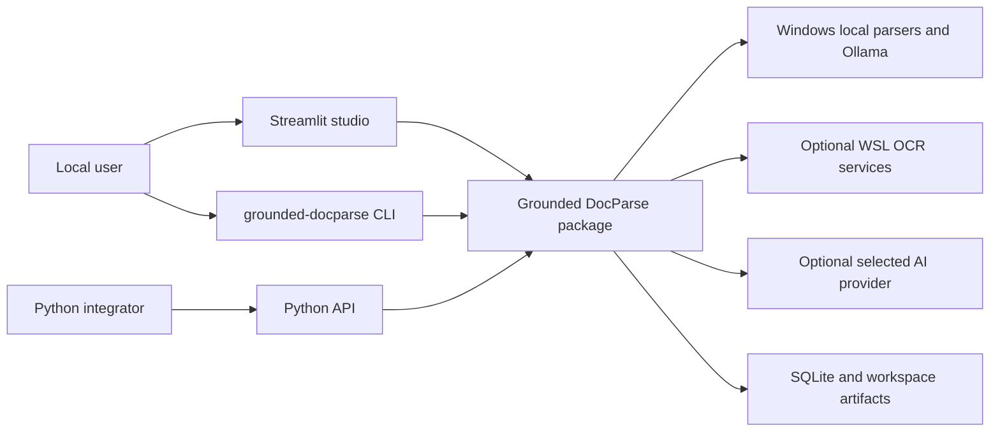
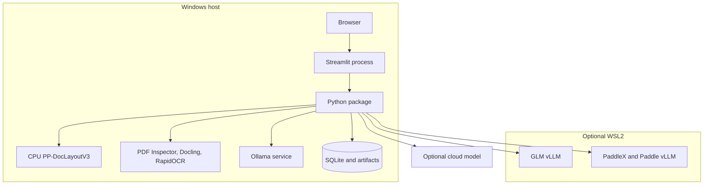
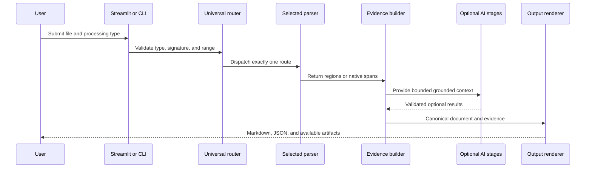

# Grounded DocParse architecture

This document is the definitive architecture guide for contributors. It describes the current checkout on branch `main` at commit `b7f21fd3689b559cf70627e3146b059ee75800d4`, including uncommitted implementation work in the working tree. Product behavior is defined by code and tests when another document disagrees.

## What the repository contains

Grounded DocParse is a local-first Python document-processing application. One Streamlit process provides the UI and orchestration. The package also exposes a CLI and synchronous Python API. Native parsers and local OCR engines produce source-linked evidence; optional AI features work on that evidence.

The package is version `0.8.0`, supports Python 3.12 through 3.14, and uses the MIT license ([pyproject.toml](../pyproject.toml#L1-L28), [LICENSE](../LICENSE)).

## Technology stack

| Layer | Technology | Evidence |
| --- | --- | --- |
| Application UI | Streamlit 1.60+ | [pyproject.toml](../pyproject.toml#L8-L19), [streamlit_app.py](../streamlit_app.py#L1) |
| Package and CLI | Python, Hatchling, `uv` | [pyproject.toml](../pyproject.toml#L1-L28) |
| Contracts | Pydantic | [pyproject.toml](../pyproject.toml#L8-L19), [models.py](../src/grounded_docparse/models.py#L1) |
| PDF and image handling | PyMuPDF and Pillow | [pyproject.toml](../pyproject.toml#L8-L19) |
| Native parsing | PDF Inspector and Docling | [pyproject.toml](../pyproject.toml#L29-L38) |
| Native extraction | LangExtract | [pyproject.toml](../pyproject.toml#L29-L38) |
| Windows layout | PyTorch, Transformers, PP-DocLayoutV3 | [pyproject.toml](../pyproject.toml#L50-L56), [grounded_ocr.py](../src/grounded_docparse/grounded_ocr.py#L1) |
| Local OCR | Ollama, GLM-OCR vLLM, PaddleOCR-VL, RapidOCR | [config.py](../src/grounded_docparse/config.py#L46-L96) |
| Cloud models | OpenAI, Google Gemini, Agnes | [config.py](../src/grounded_docparse/config.py#L15-L44), [gateways.py](../src/grounded_docparse/gateways.py#L1) |
| Persistence | SQLite and local artifact directories | [workspace_store.py](../src/grounded_docparse/workspace_store.py#L1) |
| Tests and CI | Pytest, Ruff, compileall, GitHub Actions | [ci.yml](../.github/workflows/ci.yml#L1-L30) |

## Entry points

| Entry point | Responsibility |
| --- | --- |
| `streamlit_app.py` | Uploads, routing, engine selection, progress, review, extraction, chat, and downloads |
| `grounded-docparse ingest` | Explicit native and OCR batch processing |
| `grounded-docparse parse` | Legacy PDF and image OCR batch processing |
| `DocumentParser` | Grounded OCR and direct AI parsing |
| `UniversalDocumentParser` | Processing-type validation and dispatch |
| `DocumentAgent` | Classification, table of contents, routing, extraction, and chat |

The installed CLI points to `grounded_docparse.cli:main` ([pyproject.toml](../pyproject.toml#L26-L28), [cli.py](../src/grounded_docparse/cli.py#L405)).

## Commands and verification inventory

| Command | Purpose | Evidence |
| --- | --- | --- |
| `uv sync --locked` | Install the locked development environment | [CONTRIBUTING.md](../CONTRIBUTING.md#L27-L38) |
| `Launch-Grounded-DocParse.cmd` | Prepare and run the Windows app | [launch-native.ps1](../scripts/windows/launch-native.ps1#L236-L280) |
| `uv run python -m pytest -q` | Run the full offline test suite | [ci.yml](../.github/workflows/ci.yml#L29-L30) |
| `uv run pytest tests/test_file.py -q` | Run one test module | [pyproject.toml](../pyproject.toml#L95-L97) |
| `uvx ruff check src streamlit_app.py tests scripts` | Lint Python code | [ci.yml](../.github/workflows/ci.yml#L23-L24) |
| `uv run python -m compileall -q src streamlit_app.py tests scripts` | Compile Python sources | [ci.yml](../.github/workflows/ci.yml#L26-L27) |
| `uv run grounded-docparse ingest --help` | Check the installed CLI | [CONTRIBUTING.md](../CONTRIBUTING.md#L35-L38) |
| `uv run --with markdown python scripts/build_docs_site.py` | Build the static docs site | [build_docs_site.py](../scripts/build_docs_site.py#L1-L24) |
| `powershell -File scripts/build-installer.ps1` | Build the Windows installer | [build-installer.ps1](../scripts/build-installer.ps1#L1) |

GitHub Actions runs lint, compile, and tests on `windows-latest` with Python 3.12.10 for pushes and pull requests to `main` ([ci.yml](../.github/workflows/ci.yml#L1-L30)). Whether these checks are required by branch protection is `[UNVERIFIED]` because that setting is not stored in the checkout.

## Repository map

| Path | Purpose |
| --- | --- |
| `src/grounded_docparse/` | Package contracts, parsers, gateways, rendering, persistence, and APIs |
| `streamlit_app.py` | Interactive product workflow |
| `scripts/windows/` | Native setup, process ownership, logging, and launch |
| `scripts/wsl/` | Optional GLM and Paddle service setup and lifecycle |
| `config/` | Model and service configuration |
| `paddle-runtime/` | Isolated Paddle dependency lock |
| `tests/` | Offline unit, contract, pipeline, launcher, and Streamlit tests |
| `docs/` | User, operator, explanation, and reference documentation |
| `benchmarks/` | Evaluation manifests, schemas, rate cards, and baselines |
| `installer/` | Windows installer sources |

## Runtime and deployment surface

| Surface | Pin or boundary | Evidence |
| --- | --- | --- |
| Package Python | `>=3.12,<3.15` | [pyproject.toml](../pyproject.toml#L7) |
| Managed Windows Python | 3.12 | [launch-native.ps1](../scripts/windows/launch-native.ps1#L240-L253) |
| CI Python | 3.12.10 | [ci.yml](../.github/workflows/ci.yml#L15-L19) |
| Windows PyTorch | 2.10.0 CPU | [pyproject.toml](../pyproject.toml#L50-L56) |
| WSL vLLM | 0.19.1 | [pyproject.toml](../pyproject.toml#L38-L45) |
| WSL distribution | Ubuntu 24.04 | [Install-GroundedDocParse.ps1](../installer/Install-GroundedDocParse.ps1#L1-L18) |
| Streamlit address | `127.0.0.1:7137` | [launch-native.ps1](../scripts/windows/launch-native.ps1#L269-L275) |
| GLM vLLM | `127.0.0.1:8080` | [config.py](../src/grounded_docparse/config.py#L266-L272) |
| Paddle vLLM and API | `127.0.0.1:8118`, `127.0.0.1:8119` | [run.md](run.md#L37-L44) |
| Ollama | `127.0.0.1:11434` | [ollama_runtime.py](../src/grounded_docparse/ollama_runtime.py#L43-L50) |

Support-lifecycle claims for third-party runtimes are `[UNVERIFIED]` unless a local manifest or project document states them. This document does not infer end-of-life status from version age.

## System context

## Runtime containers

## Document lifecycle

## Routing and evidence boundary

`UniversalDocumentParser` validates the caller-supplied `ProcessingType` and dispatches to one parser ([universal.py](../src/grounded_docparse/universal.py#L307-L388)). A mismatch fails closed. Mixed PDF is the only route that combines native and OCR pages, and it requires a confirmed route for each selected page.

OCR evidence consists of page elements with IDs, reading order, type, confidence, and normalized boxes. Native evidence consists of immutable `base_text`, character spans, source units, and anchors. These evidence families converge in presentation and optional document features without pretending they are the same contract.

## Grounded OCR subsystem

`PageAnalyzer` selects the runtime for GLM, Paddle, Ollama, or RapidOCR. PP-DocLayoutV3 owns detection for GLM and Ollama paths. The recognizer receives a crop and region area; the runtime emits layout and per-region progress ([grounded_ocr.py](../src/grounded_docparse/grounded_ocr.py#L321-L466)).

Ollama uses `/api/chat`, a 4,096-token context, adaptive output limits, a 120-second request timeout, and a 300-second page deadline ([ollama_runtime.py](../src/grounded_docparse/ollama_runtime.py#L18-L21), [ollama_runtime.py](../src/grounded_docparse/ollama_runtime.py#L100-L176)). Logs contain metadata and timing, not OCR text or image payloads.

The parser fails if every nonblank page lacks usable layout. Direct AI ADE also fails if a nonblank page returns no regions ([pipeline.py](../src/grounded_docparse/pipeline.py#L1948-L1958)).

## Native ingestion subsystem

PDF Inspector extracts native PDF text, layout, tables, and positions. OCR-disabled Docling handles Office and open formats. Native parsers build a frozen source representation and claim converted content against source structures. Unclaimed or unusable content fails rather than silently switching routes.

LangExtract receives only immutable `base_text`. Accepted values need exact intervals that match source text and resolve to anchors. This preserves evidence even if Markdown presentation changes.

## Agentic subsystem

`DocumentAgent.prepare` builds bounded contexts from accepted elements. Classification, table of contents, extraction, routing, and chat use structured response models and evidence validation. Provider failures remain feature-specific and do not invalidate an already completed local parse.

Direct AI ADE is different from optional visual recovery. It must call the selected provider even when the visual-recovery toggle is off. Optional recovery remains bounded to existing failed or low-confidence regions.

## Persistence and state

The workspace store separates SQLite metadata from source and result artifacts. Completed results can be restored. Stored `processing` and legacy `interrupted` rows are normalized to `pending`, and incomplete progress or results are cleared ([workspace_store.py](../src/grounded_docparse/workspace_store.py#L430-L475)).

Streamlit uses `RESULT_VERSION` to invalidate incompatible cached results. This version is independent from public JSON schema versions.

## Layering rules

1. Interfaces may call orchestration and public package APIs.
2. Universal routing validates before invoking a concrete parser.
3. Parsers produce canonical evidence models before optional AI features run.
4. Provider output must pass project-owned typed validation.
5. Renderers consume canonical models and do not become evidence owners.
6. Persistence stores versioned serialized state and isolates corrupt artifacts.

These rules are enforced mainly through module boundaries, Pydantic validation, fail-closed code paths, and tests. There is no separate architectural-lint tool.

## Cross-cutting concerns

| Concern | Implementation |
| --- | --- |
| Configuration | `ParserConfig`, environment variables, launcher-managed values |
| Secrets | Environment variables; keys must not enter logs or persisted documents |
| Logging | Streamlit-configured package logger plus launcher log following |
| Errors | Per-document isolation, feature statuses, typed failures, visible warnings |
| Security | Signature/container validation, loopback services, bounded uploads, sanitized rendering |
| Concurrency | Ordered page windows, bounded page workers, provider runtime limiter |
| Cost | Per-call usage models and launch-scoped cost summary |
| Feature controls | Explicit engine selection and opt-in AI toggles |

## Inferred architectural decisions

### ADR: Require explicit processing types

- Context: file extensions do not prove whether a PDF is native, scanned, or mixed.
- Decision: require a compatible user or CLI selection and validate it.
- Consequence: callers perform more setup, but routing remains explainable and fail-closed.

### ADR: Keep evidence ownership local

- Context: optional models can improve text but cannot be trusted to reconstruct geometry.
- Decision: deterministic parsers own IDs, boxes, spans, order, and source links.
- Consequence: AI corrections remain bounded and reviewable.

### ADR: Separate local parsing from optional AI features

- Context: provider failures must not destroy usable local output.
- Decision: store local parse results before document-level optional work.
- Consequence: features can fail independently and expose their own status.

### ADR: Use one local workstation process

- Context: the current product targets a trusted Windows workstation.
- Decision: keep Streamlit, orchestration, and local persistence in one process.
- Consequence: deployment is simple, but the app is not a multi-user service.

## Governance

CI runs Ruff, compileall, and Pytest. Public output versions, workspace compatibility, supported routes, and evidence rules must be updated deliberately. Changes to topology or commands require matching documentation changes.

## Add a feature safely

1. Identify the owning layer and existing contract.
2. Add the smallest public type or configuration change needed.
3. Preserve evidence identity and source mappings.
4. Add focused tests before widening the workflow.
5. Update output or workspace versions only when compatibility changes.
6. Update the relevant tutorial, how-to, reference, and explanation pages.
7. Run the canonical verification commands.

## Known risks

- `streamlit_app.py` and `pipeline.py` each exceed 3,000 lines, so UI and parser changes have broad impact.
- Workspace and public output versions are separate and manually coordinated.
- Windows and WSL dependency locks must remain compatible across service boundaries.
- The local workstation boundary does not provide tenant isolation.
- External support and end-of-life status are not verified from the local checkout.

## Confidence assessment

| Area | Confidence | Basis |
| --- | --- | --- |
| Package stack and commands | High | Manifests and CI |
| Routing and evidence contracts | High | Code and tests |
| Runtime topology | High | Launchers, config, and service scripts |
| Persistence behavior | High | Workspace implementation and tests |
| Branch-protection enforcement | Unverified | Not stored locally |
| Third-party lifecycle status | Unverified | External facts not consulted |

## Key local sources

- [README.md](../README.md): product purpose and supported workflow
- [pyproject.toml](../pyproject.toml): package, Python range, dependencies, and CLI
- [streamlit_app.py](../streamlit_app.py): UI and orchestration
- [universal.py](../src/grounded_docparse/universal.py): validation and routing
- [pipeline.py](../src/grounded_docparse/pipeline.py): OCR and AI parse orchestration
- [grounded_ocr.py](../src/grounded_docparse/grounded_ocr.py): layout and region recognition
- [ollama_runtime.py](../src/grounded_docparse/ollama_runtime.py): Ollama protocol and bounds
- [workspace_store.py](../src/grounded_docparse/workspace_store.py): durable state
- [ci.yml](../.github/workflows/ci.yml): automated checks
