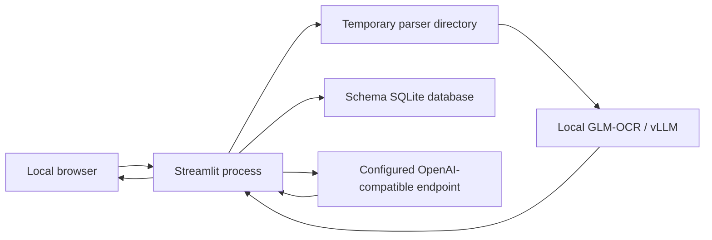

# Threat model: grounded-docparse

> Repository state reviewed: 2026-07-29.

## Executive summary

The application is designed for one trusted operator on a local workstation. Its main risks are: parsing untrusted PDFs/images in-process with native libraries; indirect prompt injection through visible document content sent to Luna; disclosure of document content to the configured OpenAI-compatible endpoint; and local denial of service from large or adversarial files. The Streamlit application has no authentication or tenant isolation, and the launchers do not enforce a loopback bind, so ports `8501` and `8080` require host/network protection.

The current default path is GLM-first and raster-only. The embedded/selectable PDF text layer is not consumed. Visible page content is still rasterized, recognized by GLM, and may later be sent to Luna as crops or recognized Markdown/layout context. GLM-owned IDs, boxes, type, confidence, order, and structure cannot be changed by Luna.

## Scope and assumptions

In scope:

- `streamlit_app.py`
- `src/grounded_docparse/*.py`
- `scripts/wsl/*.sh` and root launchers
- schema persistence and generated/downloaded results

Out of scope:

- vulnerabilities in the external OpenAI-compatible endpoint, local vLLM service, model weights, browser, WSL, GPU driver, and operating system except where this repository configures their boundary;
- test fixtures and historical benchmark quality claims.

Assumptions:

- Streamlit and vLLM remain on a trusted local workstation.
- The operator controls environment variables and chooses the endpoint.
- Uploaded documents may be malicious and may contain sensitive data.
- The application is single-user and does not provide authorization.
- The operator is responsible for patching and hardening the browser, OS, WSL, GPU driver, local vLLM service, model supply chain, and chosen endpoint.

## Components and trust boundaries

| Component | Current responsibility | Security relevance |
| --- | --- | --- |
| `streamlit_app.py` | Upload, options, schema UI, parse/extract/chat calls, downloads | Browser entry point; displays bounded exception text; no authentication |
| `src/grounded_docparse/ingest.py` | Validates bytes and decodes/rasterizes PDF/image pages | Native MuPDF/Pillow attack surface; temporary cleartext files |
| `src/grounded_docparse/local_ocr.py` / `src/grounded_docparse/page_analysis.py` | Calls local GLM-OCR and normalizes regions | Receives full rendered pages; model output is untrusted |
| `src/grounded_docparse/pipeline.py` | Recovery selection, validation, hierarchy, result assembly | Enforces GLM ownership and recovery limits |
| `src/grounded_docparse/gateways.py` | OpenAI Responses API calls with `store=False` | External data egress; document prompt-injection boundary |
| `src/grounded_docparse/agentic.py` / `src/grounded_docparse/extraction.py` | Compact contexts, source validation, extraction/chat | Validates known IDs and evidence but cannot prove semantic truth |
| `src/grounded_docparse/render.py` | Markdown, JSON, elements, PDF annotations | Renders model-derived text into downloadable artifacts |
| `src/grounded_docparse/schema_store.py` | SQLite storage for reusable schemas | Intentional local persistence of user-authored schema content |
| `src/grounded_docparse/runtime.py` | Concurrency, retries, cooldown, usage | Bounds provider concurrency but not total document resource use |

Trust boundaries:

1. **Browser → Streamlit:** untrusted bytes, filename, schema data, and chat questions.
2. **Streamlit → native parsers/temp storage:** uploaded bytes become rendered page/crop files under a `TemporaryDirectory`.
3. **Parser → local GLM service:** full raster pages and local recognition results.
4. **Gateway → external endpoint:** selected crop images, structured document context, schemas, and questions.
5. **Model output → deterministic result:** typed but semantically untrusted output enters Markdown/JSON/UI after validation.
6. **Streamlit → SQLite:** schema names, descriptions, field names, and types persist until the database is deleted.

## Assets

| Asset | Objective |
| --- | --- |
| Uploaded bytes, page images, crops, and recognized text | Confidentiality, integrity |
| `OPENAI_API_KEY` | Confidentiality |
| Grounding chain: element ID, box, page, text, source spans | Integrity |
| Markdown, JSON, extraction, chat, and annotated PDF | Integrity |
| Saved schema database | Confidentiality, integrity |
| Local process, GPU memory, provider quota | Availability/cost control |

## Entry points and controls

| Surface | Current controls | Remaining gap |
| --- | --- | --- |
| File upload | Extension allowlist; PDF magic check; Pillow verification; byte/page/pixel limits; password-protected PDF rejection | Native decoding remains in-process and unsandboxed |
| PDF/image rasterization | Temporary directory removed after `parse`; source filename is not used as a filesystem path | Cleartext pages/crops exist while parsing; no process isolation |
| Local GLM output | Pydantic/deterministic normalization; no selectable PDF text | A malicious visible instruction can influence recognition text |
| Luna crop recovery | Max eight crops/document, three/page; high effort; existing IDs only; text-only corrections; confidence ≥ `0.85` | Vision models can still misread or follow visible instructions |
| Classification/TOC/extraction/chat | Structured Outputs; one schema retry; known-ID/page validation; extraction evidence checks | Schema-valid output may still be semantically misleading |
| Custom endpoint | Standard SDK transport and environment-based configuration | No endpoint allowlist, pinning, or preflight destination display |
| Schema store | Parameterized SQLite statements; fixed default path; gitignored `data/` | No encryption or per-user separation |
| Streamlit/vLLM listeners | Launcher uses local URLs and trusted-workstation assumption | No enforced Streamlit loopback address, application authentication, or tenant isolation |

## Abuse paths

### TM-001: malicious native document parsing

A crafted PDF/image triggers a MuPDF or Pillow vulnerability during verification, decoding, rendering, or cropping. Successful process compromise could expose the API key and readable local files.

- Likelihood: low
- Impact: high
- Priority: medium under localhost-only deployment
- Mitigation: keep locked dependencies current; parse untrusted files in a constrained subprocess/container before processing sensitive documents.

### TM-002: indirect prompt injection

Visible document text instructs Luna to ignore its task or fabricate values. Structured response validation preserves shape, not truth. Grounding makes manipulation inspectable and rejects unknown IDs, but a wrong value can cite a real nearby element.

- Likelihood: medium
- Impact: medium
- Priority: medium
- Mitigation: treat all Luna output as untrusted; require human review for high-impact fields; consider instruction-pattern telemetry without using it as the sole defense.

### TM-003: endpoint confidentiality loss

The operator configures `OPENAI_BASE_URL` to a proxy or service that logs requests. Recovery crops and document context leave the workstation and may be retained under that endpoint's policy.

- Likelihood: operator-dependent
- Impact: high for sensitive documents
- Priority: medium
- Mitigation: use only an approved endpoint; surface the destination host before parsing; do not assume `store=False` controls intermediaries.

### TM-004: local resource exhaustion

A document near the 250 MiB, 500-page, or 20-million-pixel-per-page limits consumes CPU, RAM, disk, GPU, or provider quota. Eight page workers and eight provider calls may overlap.

- Likelihood: low to medium
- Impact: low to medium on a single-user workstation
- Priority: low
- Mitigation: lower limits for untrusted corpora; add a document-wide decoded-pixel budget and peak-memory telemetry if exposure increases.

### TM-005: unauthenticated network exposure

Streamlit or vLLM is reachable from an untrusted network. Another user can upload documents, consume provider quota, view session output, or exercise parsing/model surfaces.

- Likelihood: low under the documented deployment
- Impact: high
- Priority: medium
- Mitigation: keep the service local; if shared deployment is required, add an authenticated reverse proxy, TLS, tenant isolation, quotas, and a separate security design before exposure.

### TM-006: residual local data

Temporary parse files are deleted after the call, but downloaded outputs, logs, browser state, legacy `.docparse/` data, and `data/document_studio.sqlite3` may remain.

- Likelihood: medium
- Impact: sensitivity-dependent
- Priority: low
- Mitigation: use approved download locations; delete saved schemas and legacy data explicitly; apply OS disk protections.

## Security invariants

- Luna cannot create or delete canonical elements.
- Luna cannot modify canonical geometry, element identity, type, confidence, order, or hierarchy.
- Full-page Luna fallback and missing-region synthesis are disabled in the default app path.
- Unknown extraction/chat/TOC element IDs are not exposed as valid sources.
- Rejected blocks are excluded from agentic contexts and extraction evidence.
- Requests use `store=False`; keys are read from environment variables and are never intentionally logged.
- Annotated-PDF overlay labels use internal IDs/types rather than arbitrary model text.

## Reassessment triggers

Re-run this threat model before any of the following:

- exposing Streamlit or vLLM beyond localhost;
- processing regulated or production documents;
- adding persistent parse/chat history;
- adding an HTTP API, jobs, workers, object storage, or multiple users;
- enabling full-page external vision or selectable PDF-text extraction;
- changing native parser, model gateway, or authentication architecture.
